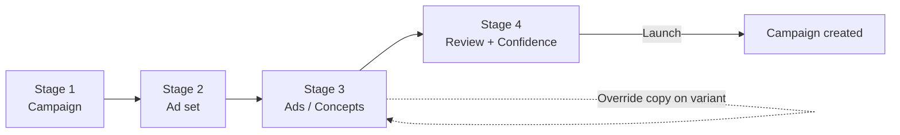

# feat: Meta-aligned campaign builder with concepts and ad-set visibility

## Overview

Restructure the Meta campaign creation wizard and the campaign detail page to match how professional Meta advertisers actually think about and configure paid social. Three intertwined shifts:

1. **Expose Meta's hierarchy explicitly** — `Campaign > Ad set > Ad` is visible everywhere ads are created, reviewed, or analyzed. Default ad sets are clearly named ("Spring Exterior — Default Ad Set"). The current abstraction that hides ad sets goes away.
2. **Reorder the wizard to mirror Meta's setup order** — collapse from 5 internal steps to 4 explicit stages: **Campaign → Ad set → Ads → Review**. Campaign-only decisions (objective, budget, bid strategy) live at Stage 1; ad-set-level decisions (audience, pixel, destination URL, geo) move to Stage 2; creative work moves to Stage 3 grouped under concepts; final confirmation including hierarchy is Stage 4.
3. **Introduce a "Creative Concept" layer above ads** — a Concept is the strategy unit (source angle + value prop + audience + offer + key message + shared copy bundle) that Andrew described as client-explainable. Variants live underneath a concept and inherit copy (primary text / headline / description / CTA) with per-ad override marked as a deviation test. Default scaffold is `1 campaign → 1 ad set → 1 concept → multiple variants`.

Two supporting features land alongside: **ad-naming controls** (optional custom name per variant + default generator + preview before publish), and a **learning loop** UX on the detail page that surfaces "what's working, why, what to try next" per ad and per concept as a small set of insight modules.

Critical constraint from the user: *"the general UI/UX we have right now received positive feedback, so any changes should fit cleanly into what we already have."* The visual surface — purple-AI styling, `CreativeCard`/`KpiTile`/`SectionCard`/`TabChip`/`Toggle`/confidence-layer components — is preserved. The data model + step ordering + new Concept hierarchy slot under that surface; the user-visible reorganization should feel like a natural maturation, not a rebuild.

## Problem Frame

Andrew's feedback after reviewing the prototype focused on three structural concerns:

- **Hidden ad sets erode trust** for professional Meta operators. They expect to see `Campaign > Ad set > Ad` everywhere and know exactly which ad set a creative will land in before publish. Our current wizard abstracts ad sets away entirely.
- **Wizard ordering mixes campaign-level and ad-set-level decisions**, which slows down experienced operators. Meta's actual setup order is: configure Campaign first (objective, budget, bid), then the Ad set (audience, pixel, placements), then Ads (creative). Our current flow puts audience + destination URL on Step 1 (Goal) and inspiration/creative selection on Step 2, which is the wrong order.
- **Flat creative selection loses the strategy story.** Today users pick from a flat slate of 5 mixed-source ads. Andrew wants users to see and approve *concepts* first (the strategic angles), then inspect/edit the variants underneath. Concepts position the work as client-explainable strategy units, not just "creatives."

A fourth thread runs through the feedback: **Blaze's most defensible value is in the learning loop**, not dashboard replication. The system should generate insights you wouldn't easily get in Meta — "why this ad is working," "angles that seem to be working," "3 variants to create next." Today our detail page replicates Meta-style KPIs and adds a thin recommendations panel; it should lean harder into Blaze-as-strategist.

A fifth thread is operational: **mature advertisers use naming conventions** to track assets. We should expose ad naming as an optional advanced field with a sensible default generator and a preview before publish.

## Requirements Trace

From the spec sections 2–8 plus the functional requirements A–F:

- **R1.** Campaign > Ad set > Ad hierarchy is visible everywhere ads are created, reviewed, or analyzed (spec §2, FR §B).
- **R2.** Default ad sets get a human-readable name (`{Campaign Name} – Default Ad Set`) and users always know whether ads target an existing or new ad set (spec §2, FR §B).
- **R3.** Review/publish stage shows: campaign name, ad set name, audience/targeting summary, destination confirmation, and the full hierarchy of what will be published (spec §2, FR §A.4).
- **R4.** Wizard restructures to 4 stages in Meta order: Campaign → Ad set → Ads → Review (spec §3, FR §A).
- **R5.** Stage 1 captures campaign-level fields: name, objective, special ad category, budget type (daily vs lifetime), budget amount, bid strategy (spec §3.1, FR §A.1).
- **R6.** Stage 2 captures ad-set-level fields: ad set name, performance goal, conversion event, pixel, audience definition, geo targeting, placement-relevant setup, destination URL (spec §3.2, FR §A.2).
- **R7.** Stage 3 surfaces concepts first, with variants underneath. Concept selection and per-concept copy editing are the primary surface (spec §3.3, FR §A.3).
- **R8.** Stage 4 confirms the structure before publish (spec §3.4, FR §A.4).
- **R9.** A new domain object — **Creative Concept** — appears in the UI with: name, rationale, intended audience, value prop / offer, key message, sourceType, associated variants (spec §4, FR §C).
- **R10.** Default prototype model is `1 campaign / 1 ad set / 1 concept / multiple ad variants`. Optional affordance to add another concept later, but v1 doesn't force it (spec §5, FR §C).
- **R11.** Concept-level copy bundle (primary text / headline / description / CTA) is the default for all variants under the concept; per-variant override is allowed and visually marked as a deviation (spec §6, FR §D).
- **R12.** Per-ad/per-concept learning-loop modules: "what's happening," "why," "recommended next actions," "suggested variants to test" (spec §7).
- **R13.** Optional custom ad name field with default generator, preview before publish, foundation for structured naming templates (spec §8, FR §F).

## Scope Boundaries

- **Not** refactoring the `AddAdsModal` (in-campaign add-ads flow) to be concept-aware in v1. It continues to operate with the existing per-ad shared-copy model. Note this as a known consistency gap to address in v2.
- **Not** implementing real Meta API integration — every new field (bid strategy, pixel id, conversion event, performance goal) is configured at the UI layer and persisted on the draft/campaign object. Defaults are pre-filled; values don't actually drive delivery.
- **Not** supporting *multiple* ad sets in a single campaign in v1. The default scaffold is `1 ad set per campaign` and that's what the wizard creates. The data model supports `adSets: AdSet[]` so v2 can extend without re-shaping types, but the UI exposes only one.
- **Not** rebuilding the existing confidence-layer components (CampaignSummary, SimilarToCard, PreflightChecklist, SafetyNetEditor — just landed in PR #47). They migrate to Stage 4 wholesale with field-reference updates; their behavior is preserved.
- **Not** implementing real "learning loop" ML — the insights generators are heuristic synthesizers (same approach as `findSimilarCampaign`). They produce plausible-looking copy from in-memory campaign data.
- **Not** automated tests — `CLAUDE.md` rule #8 disallows snapshot tests for prototypes; verification per unit is manual scenarios.
- **Not** changing eng-protected directories (`src/components/`, `src/icons/`) — all new files live under `prototypes/h2/meta-campaign/` or modify existing prototype files.
- **Not** changing the `MetaCampaignStep` cardinality interface beyond reducing from 5 to 4. The progress rail's STAGES array updates in place.
- **Not** retrofitting the Add Ads modal or other surfaces to use concept-level shared copy. v2 work.

## Context & Research

### Relevant Code and Patterns

- **Wizard shell** — `prototypes/h2/meta-campaign/MetaCampaignModal.tsx`. Owns the step dispatch, progress rail (STAGES array), Continue/Launch button gating. The 5→4 step transition and label changes anchor here.
- **State container** — `prototypes/h2/meta-campaign/meta-campaign-context.tsx`. Today holds: `draft` (MetaCampaignDraft), `generatedAds` (flat), `selectedStyles` (Set of source ids), `createdCampaigns`, `addedAdsByCampaign`, `safetyNetByCampaign`, `pendingSafetyNet`, `launchBlocked`. The shape changes substantially — `concepts` becomes the new mid-layer; `generatedAds` moves under each concept; `adSet` is split out from campaign-level draft.
- **Step components** — `prototypes/h2/meta-campaign/steps/{Step1Goal, Step2Inspiration, Step3Generating, Step4Creative, Step5Review}.tsx`. Step1Goal and Step5Review refactor; Step2/Step3/Step4 are removed and their behavior is folded into a new Stage 3.
- **Creative slate sources** — `prototypes/h2/meta-campaign/{proven-ads, organic-creative, competitor-creative, ai-creative}.ts`. Their data shapes carry into the new Concept model: each becomes a way to *seed* a Concept (sourceType + initial copy + initial variants).
- **AI row UX pattern** — `prototypes/h2/meta-campaign/AiGeneratedList.tsx`'s row-based `AiRow` (reference image + concept text + format dropdown + regenerate/trash) is the template for the new `ConceptCard` interactive row.
- **Per-variant editable card** — `Step4Creative.tsx`'s `AdVariantCard` (provenance bar + Meta feed preview + headline/CTA/caption inputs) is the template for variant editing within a concept, but with the editable fields *hidden by default* (variants inherit concept copy; users open a per-variant "Override" affordance to deviate).
- **Confidence layer** — `prototypes/h2/meta-campaign/confidence/{CampaignSummary, SimilarToCard, PreflightChecklist, SafetyNetEditor, WhyPopover}.tsx` plus helpers (`preflight.ts`, `summary.ts`, `defaults.ts`, `similar-campaign.ts`). All migrate to Stage 4 with field reference updates (`draft.adHeadline` → `concept.copy.headline`, etc.).
- **Detail page** — `prototypes/h2/pages/PaidSocialDetail.tsx`. KpiStrip, CreativeHealth, AdsTable (list/grid), TargetingCard, RecommendationsCard, SafetyNetCard. `AdsTable` grows a concept-grouping layer; a breadcrumb appears under the campaign title; `RecommendationsCard` is replaced by `LearningLoopCard`.
- **Seed data** — `prototypes/h2/pages/PaidSocial.tsx` `CAMPAIGNS` array. Each Campaign has a flat `ads: Ad[]`. Retrofit pattern: wrap in a synthesized default ad set + default concept so the detail page renders coherently after the refactor.
- **Dropdown / popover patterns** — `TimeRangeSelect` (ref-based outside-close), `FormatDropdown` in `AiGeneratedList`, `ContentTypeDropdown` in `organic-campaign/steps/Step5ReviewTopics.tsx`. Same visual idiom for the new bid-strategy / performance-goal / conversion-event selects.
- **Section card framing** — `Step5Review.tsx`'s `SectionCard` / `SectionHeading` / `SummaryRow` helpers. New Stage 2 / Stage 3 / Stage 4 reuse these for visual consistency.
- **PrototypeShell + step body container** — `prototypes/h2/meta-campaign/MetaCampaignModal.tsx`'s body has `maxWidth: 1024` / `maxWidth: 760` per step. Maintain the same widths in the new stages.

### Institutional Learnings

- `CLAUDE.md` rule #8: snapshot tests are vetted-only — prototypes verify manually.
- `CLAUDE.md` rule #1: never reinvent components — compose from `@/components` or `@/staging`. New Concept-related controls reuse existing Toggle, StatusPill, TabChip, Button, Heading, Text.
- `CLAUDE.md` rule #3: only use design tokens. All colors via `var(--dark-90)`, `var(--purple)`, `var(--status-approved)`, etc.
- `CLAUDE.md` rule #4: never edit `src/components/` or `src/icons/` from a prototype task. All new files are under `prototypes/h2/meta-campaign/`.
- Pattern from PR #47: the confidence layer's pure-helper-modules approach (similar-campaign.ts, preflight.ts, summary.ts) worked well. Apply the same shape to the new learning-loop insights generator and the new concept-default-builder.
- Recent precedent: `addedAdsByCampaign` + `setAddAdsToCampaign` on the context is the canonical pattern for per-campaign state slices. The new `conceptsByCampaign` and similar slices mirror it.

### External References

Skipped per Phase 1.2 — Andrew's feedback IS the canonical product spec, strong local patterns exist for every component shape, no external integration or compliance concerns.

## Key Technical Decisions

- **Hard restructure, not a hybrid.** The wizard collapses from 5 internal steps to 4 explicit stages. Old `Step1Goal`/`Step5Review` refactor in place; old `Step2Inspiration`/`Step3Generating`/`Step4Creative` are deleted and their value is folded into the new `Stage3Ads`. Hybrid would preserve the structural complaint Andrew flagged.
- **Concept is a real domain object with one sourceType.** Each concept has exactly one sourceType (`proven` | `organic` | `competitor` | `ai`), one strategic angle (audience + value prop + offer + key message), and one shared copy bundle (primary text + headline + description + CTA). Variants underneath differ in creative format/execution but inherit copy and source. This matches the spec literally and clarifies the data model.
- **Variants store copy fields only when they deviate.** A variant carries an optional `overrides: { headline?, primaryText?, description?, cta? }` field. Rendered copy = `concept.copy` merged with `variant.overrides`. Override status is shown visually as a "Deviation from concept copy" badge. This makes "Allow per-ad override, but mark it clearly as a separate test" cheap.
- **Internal `step: 1|2|3|4`, external "Campaign / Ad set / Ads / Review" labels.** Keep the type churn minimal. The progress rail's STAGES array and continueLabel switch update in place.
- **Drop the dedicated generating screen; inline it.** `Step3Generating` had narrative value but split a single user task across two screens. The new Stage 3 shows the recommended concept(s) directly; if loading is needed (e.g., on regenerate), an inline skeleton on the concept card suffices.
- **Default scaffold is 1 concept; "+ Add concept" is exposed but de-emphasized.** Matches the spec's preference. Single-concept campaigns are the common case for early-stage Blaze users; multiple concepts is an advanced affordance.
- **Concept-level copy doesn't change variant copy fields automatically when the concept copy is edited.** Variants store either nothing (= inherit) or an explicit override. Editing concept copy after a variant has an override leaves the override intact — and we surface this with a "1 variant deviates" indicator on the concept header.
- **AdSet object lives on the campaign in v1 with `adSets: [singleAdSet]`.** The data model supports multiple ad sets; the UI only exposes one. v2 can light up multi-adset UX without a re-shape.
- **Confidence layer migrates wholesale to Stage 4.** All five components (CampaignSummary, SimilarToCard, PreflightChecklist, SafetyNetEditor, WhyPopover) move; their internal field references update (`draft.adHeadline` → `concept.copy.headline` and similar). Preflight checks gain ad-set-aware items (e.g., "Pixel selected on ad set," "Conversion event set").
- **Learning loop generators are heuristic, not ML.** Pure functions over in-memory campaign + concept + ads data, returning plausible insight text. Same approach that worked for `findSimilarCampaign`.
- **Ad naming uses a derived default + optional override.** Pattern: `{Campaign first word}_{Concept first word}_{Variant format}_{Sequence}`. Custom override is a field on `GeneratedAd` (`customName?: string`). Preview rendered in Stage 4 review and the detail page name column.
- **Seed CAMPAIGNS retrofit synthesizes default ad set + default concept around the existing `ads: Ad[]`.** Pure-function wrapper at read time; no mutation of the const. Keeps the detail page's new concept-grouped renderer happy without forking seed data.
- **Place all new files under `prototypes/h2/meta-campaign/concept/` and `prototypes/h2/meta-campaign/learning/`** subfolders. Keeps the surface visually grouped in the file tree, matches the precedent set by `confidence/`.
- **AddAdsModal is left as-is in v1.** Its existing flat shared-copy model is acknowledged as inconsistent with the new concept-level copy model in the wizard; deferred to a v2 sweep. Add a small comment header in `AddAdsModal.tsx` noting the inconsistency so future maintainers know.

## Open Questions

### Resolved During Planning

- **How does sourceType map to existing data?** Each of the four creative sources (`PROVEN_ADS`, `ORGANIC_CREATIVE`, `COMPETITOR_CREATIVE`, `AI_CREATIVE`) becomes a concept-seeding path. When the user adds a concept and picks a sourceType, the available "starting points" are pulled from that source's catalog. Variants inside the concept can still be a mix of formats but share the source.
- **How does the wizard land on its default state?** `start()` builds a default Concept from a single Blaze recommendation (the first proven ad, by default, since past winners are the strongest signal). Variants under the default concept are 3-5 cuts from the same source, plus optionally one cross-source variant for diversity. User can swap source via the "+ Add concept" affordance or replace the default concept entirely.
- **What goes into the "key message" field?** It's user-visible plain text — usually the concept's central claim ("2-year warranty + free estimate"). On Blaze-seeded concepts, it's pre-filled from the source's hook field.
- **Where does the `topic` field from the current draft go?** It moves to the Campaign level as `campaignTopic` and is used by the campaign summary + by concept generation prompts.
- **Where does `websiteUrl` go?** Moves from campaign-level (today on Step 1) to ad-set-level (Stage 2). The Ad set owns the destination URL because Meta scopes destinations there.
- **Where does `specialCategories` go?** Stays at campaign-level (Stage 1), matching Meta's structure.
- **What gets shown in the breadcrumb on the detail page when there's only one ad set?** Render the breadcrumb anyway: `Paid Social / {Campaign} / {Ad set} / Ad`. Even with one ad set, visibility is the point.
- **Does the existing slate UX (mixed source grid) survive anywhere?** No. The "library" sub-grid in Step2Inspiration was its primary home; the new Stage 3 replaces it with concept cards. The four source-pickers remain reachable via the "+ Add concept" picker but are gated behind a smaller modal, not the primary surface.
- **What does the variant override UI look like?** Each variant card in Stage 3 shows the inherited copy as read-only text by default with an "Override copy" affordance. Clicking it expands the same four-field editor inline. A small "Deviates from concept" badge appears whenever overrides are non-empty. Clearing overrides reverts to inheritance.
- **Where does the WhyPopover anchor for concepts?** On the concept card header, next to the concept name. Copy: "Why this concept?" — explains source, audience match, and angle rationale.
- **What does the LearningLoopCard replace on the detail page?** Replaces `RecommendationsCard`. Same slot in the layout grid (right of TargetingCard). Existing recommendations are absorbed into the new "Recommended next actions" module within LearningLoopCard.

### Deferred to Implementation

- **Final copy templates for the four insight modules.** First-cut copy is drafted in Unit 8; refine in PR review with Andrew's eye.
- **Per-variant Override toggle wording.** "Override copy" vs "Customize copy for this variant" vs "Test different copy" — wordsmith in Unit 4.
- **Exact bid-strategy / performance-goal / conversion-event option lists.** Initial proposal in Unit 3 / Unit 4; verify Andrew's preferred wording during PR review.
- **Whether `customName` should preview live as the user types or only on Stage 4.** Default to: editable on Stage 3 (per variant), previewed in Stage 4. Adjust if it feels clumsy.
- **Whether to surface "Variants from a different sourceType" inside a concept.** v1 default: no. Spec defines sourceType at concept level. If reviewers want cross-source variants, address in v2.

## High-Level Technical Design

> *This illustrates the intended approach and is directional guidance for review, not implementation specification. The implementing agent should treat it as context, not code to reproduce.*

### New domain hierarchy

```mermaid
classDiagram
  Campaign "1" --> "1..*" AdSet
  AdSet "1" --> "1..*" Concept
  Concept "1" --> "1..*" Variant
  Concept o-- CopyBundle
  Variant o-- "0..1" CopyOverrides

  class Campaign {
    id
    name
    campaignTopic
    objective
    specialCategories
    budgetType  daily | lifetime
    budgetAmount
    bidStrategy
  }
  class AdSet {
    id
    name              default "{Campaign} – Default Ad Set"
    performanceGoal
    conversionEvent
    pixelId
    websiteUrl        moves here from campaign-level
    audience          age range + gender + language + locations
    geoTargeting
  }
  class Concept {
    id
    name
    rationale
    intendedAudience
    valueProp
    offerAngle
    keyMessage
    sourceType        proven | organic | competitor | ai
    sourceRefId       which entry in PROVEN_ADS / ORGANIC_CREATIVE / etc.
    copy              CopyBundle
  }
  class CopyBundle {
    primaryText
    headline
    description
    cta
  }
  class Variant {
    id
    format            Reel | Static | Carousel | UGC
    image
    customName?       optional override
    overrides?        CopyOverrides — none means inherit
    included          boolean
  }
  class CopyOverrides {
    primaryText?
    headline?
    description?
    cta?
  }
```

### Wizard flow



### Stage 3 (Ads / Concepts) composition

```
┌─ Stage 3: Ads ─────────────────────────────────────────────────────┐
│ Heading: "Pick your concepts" + 1-line rationale                   │
│                                                                     │
│ ┌─ Concept Card #1 (default-recommended, expanded) ──────────────┐  │
│ │ ✨ Owner-led trust play                       Source: Past winner│  │
│ │ Audience: Austin homeowners 25-65   Why this concept? [✨]      │  │
│ │ Value prop: Local, owner-backed, 2-yr warranty                 │  │
│ │ Key message: "1,200 Austin homes since 2008"                   │  │
│ │                                                                  │  │
│ │ ── Shared copy (variants inherit) ─────────────                 │  │
│ │ Primary text:  [textarea]                       [Regenerate ↻]  │  │
│ │ Headline:      [input]                          [Regenerate ↻]  │  │
│ │ Description:   [input]                                          │  │
│ │ CTA:           [Get estimate ▾]                                 │  │
│ │                                                                  │  │
│ │ ── 4 Variants ─────                                              │  │
│ │ ┌────────┬────────┬────────┬────────┐                          │  │
│ │ │Reel A  │Reel B  │Static C│Carousel│  ← variant preview cards │  │
│ │ │[img]   │[img]   │[img]   │[img]   │                          │  │
│ │ │ Name…  │ Name…  │ Name…  │ Name…  │  ← ad name (editable)    │  │
│ │ │ Inherit│Override│ Inherit│ Inherit│  ← inherit/override badge│  │
│ │ │ [Tgl]  │ [Tgl]  │ [Tgl]  │ [Tgl]  │  ← include toggle        │  │
│ │ └────────┴────────┴────────┴────────┘                          │  │
│ └──────────────────────────────────────────────────────────────────┘  │
│                                                                     │
│ [+ Add concept]    ← opens small picker (source → start)            │
└─────────────────────────────────────────────────────────────────────┘
```

### Stage 4 (Review) composition

```
┌─ Stage 4: Review ──────────────────────────────────────────────────┐
│ Heading: "Review & launch"                                          │
│                                                                     │
│ ┌─ Hierarchy summary ─────────────────────────────────────────────┐  │
│ │ Campaign:   Spring Exterior — Competitor Playbook              │  │
│ │   ↳ Ad set:   Spring Exterior — Default Ad Set                 │  │
│ │       ↳ Concept: Owner-led trust play  (4 variants)            │  │
│ │           ↳ Variants list with custom/default names + previews │  │
│ └─────────────────────────────────────────────────────────────────┘  │
│                                                                     │
│ ┌─ Audience + Spend (existing surfaces, lifted from old Step 5) ─┐  │
│ └─────────────────────────────────────────────────────────────────┘  │
│                                                                     │
│ ── Pre-launch confidence (migrated from PR #47) ──                  │
│ <CampaignSummary>   (paragraph now references concept name + ad set)│
│ <SimilarToCard>     (matcher unchanged; uses campaign-level signals)│
│ <PreflightChecklist> (new ad-set-aware items: Pixel set, Conv event)│
│ <SafetyNetEditor>   (preserved; persists onto campaign at launch)  │
│                                                                     │
│ [Back]                                            [Launch campaign] │
└─────────────────────────────────────────────────────────────────────┘
```

## Phased Delivery

### Phase 1 — Foundation
Units 1 & 2 land first. Without these, every other unit is blocked. They restructure the data model + provider state with no UI changes yet (the wizard temporarily breaks while the new state is plumbed; the implementer fixes downstream in Phase 2). Should land as one PR or two tightly-coupled commits.

### Phase 2 — Wizard restructure
Units 3, 4, 5, 6, 7 rebuild the four-stage wizard surface plus ad-naming controls. Each stage is one unit; ad naming (Unit 6) is a small cross-cutting addition that plumbs across Stage 3 and Stage 4. Land as a single PR — partial states between units leave the wizard broken.

### Phase 3 — Detail page
Units 8 & 9 — breadcrumb + concept grouping on the detail page (Unit 8) and the LearningLoopCard replacement (Unit 9). Can ship in a separate PR from Phase 2 since it consumes the new data model but doesn't introduce new fields. Recommended: include the seed data retrofit (Unit 10) in this PR so the detail page has data to render.

### Phase 4 — Migration + final stitch-up
Unit 10 retrofits seed CAMPAIGNS, finalizes default scaffold, and verifies end-to-end. Can land with Phase 3 or separately.

## Implementation Units

- [ ] **Unit 1: Domain model — AdSet, Concept, Variant types + helpers**

**Goal:** Land the new type system. Three new types (`AdSet`, `Concept`, `Variant`), a `CopyBundle` shape, and pure-function helpers for default-construction + inheritance resolution. No UI changes yet — pure data layer.

**Requirements:** R9, R10, R11

**Dependencies:** None.

**Files:**
- Create: `prototypes/h2/meta-campaign/concept/types.ts` — `AdSet`, `Concept`, `CopyBundle`, `CopyOverrides`, `ConceptSourceType`. `Variant` extends the existing `GeneratedAd` shape with `customName?`, `overrides?`, removes the now-concept-level `headline`/`cta`/`primaryText` (these become accessed via `resolveVariantCopy(variant, concept)`).
- Create: `prototypes/h2/meta-campaign/concept/defaults.ts` — `defaultAdSetName(campaignName)`, `defaultConceptFromSource(sourceType, draft)`, `defaultVariantsForConcept(concept)`. Reuses existing source data files (`proven-ads.ts`, etc.).
- Create: `prototypes/h2/meta-campaign/concept/copy.ts` — `resolveVariantCopy(variant, concept)`, `variantHasDeviation(variant)`. Pure helpers.
- Modify: `prototypes/h2/meta-campaign/meta-campaign-context.tsx` — extend the existing `MetaCampaignDraft` to add `budgetType`, `bidStrategy`, `campaignTopic` (renamed from `topic`); remove `adHeadline`, `adCta`, `adCaption` (now concept-level); remove `websiteUrl` from draft (it moves to ad set). Add `adSetDraft: AdSetDraft` and `concepts: ConceptDraft[]` to context state.
- Modify: `prototypes/h2/pages/PaidSocial.tsx` — extend `Campaign` interface with `adSets?: AdSet[]` (optional so seed data doesn't immediately break). Leave existing `ads: Ad[]` field for back-compat; the detail-page renderer uses a helper to migrate flat ads to `defaultAdSet → defaultConcept → variants` view at read time.

**Approach:**
- New types live alongside existing source-data files but with their own `concept/` folder for visual grouping.
- `Variant` is an alias for the refactored `GeneratedAd` (rename optional — keep `GeneratedAd` for back-compat, add `Variant = GeneratedAd`).
- `CopyBundle` is a small fixed shape with four string fields; `CopyOverrides` is the same shape with each field optional.
- `resolveVariantCopy(variant, concept)` returns `{ ...concept.copy, ...variant.overrides }` style merge.
- `variantHasDeviation(variant)` returns `true` when any `overrides` key is non-empty.
- `defaultAdSetName('Spring Exterior — Competitor Playbook')` → `'Spring Exterior — Competitor Playbook – Default Ad Set'` (em-dash plus en-dash separator per the spec).

**Patterns to follow:**
- Existing data-only modules under `prototypes/h2/meta-campaign/` — flat exports, no React.
- `confidence/types.ts` as the precedent for grouping types in a new subfolder.
- `addedAdsByCampaign` as the precedent for an extra context-state slice (Unit 2 will mirror its shape for the new concept-related slices).

**Test scenarios (manual):**
- `defaultAdSetName('Foo')` → `'Foo – Default Ad Set'`.
- `defaultConceptFromSource('proven', defaultDraft)` returns a concept with all CopyBundle fields populated, a non-empty rationale, audience, valueProp, keyMessage, and at least 3 variants.
- `resolveVariantCopy(variantWithNoOverrides, concept)` returns the concept's full copy bundle.
- `resolveVariantCopy(variantWithHeadlineOverride, concept)` returns the concept bundle with the variant's headline substituted.
- `variantHasDeviation(variantWithEmptyOverrides)` returns `false`.
- TypeScript compiles cleanly across all referencing files (initial check: `pnpm typecheck` flags every prop drilling that needs to update — this is expected scaffolding for Unit 2).

**Verification:**
- All new types and helpers exist and are importable from `concept/`.
- `tsc --noEmit` shows expected errors in files that consume the old draft shape (Step1Goal, Step5Review, etc.) — these are the breadcrumbs Unit 2 follows.

---

- [ ] **Unit 2: Provider state restructure — concepts + ad set draft**

**Goal:** Rebuild `MetaCampaignProvider` around the new hierarchy. New context state slices: `adSetDraft`, `concepts`, plus actions for `addConcept`, `removeConcept`, `updateConcept`, `updateConceptCopy`, `addVariantToConcept`, `updateVariant`, `setVariantOverride`, `clearVariantOverride`, `setAdSetField`. Wire `start()`, `next()`, `back()`, `finish()` to the new shape.

**Requirements:** R9, R10, R11

**Dependencies:** Unit 1.

**Files:**
- Modify: `prototypes/h2/meta-campaign/meta-campaign-context.tsx` (large refactor — net add ~150 lines, net remove ~50).

**Approach:**
- Replace the old `selectedStyles: Set<string>` + `generatedAds: GeneratedAd[]` state with `concepts: ConceptDraft[]`. Each concept carries its own variants array. The old `selectedStyles` is gone — when the user "adds a concept from proven," the concept is materialized inline with its variants, not separately tracked.
- Add `adSetDraft: AdSetDraft` state with `name` (default from `defaultAdSetName`), `performanceGoal` (default `'maximize-leads'`), `conversionEvent` (default `'Lead'`), `pixelId` (mock string), `websiteUrl` (moved from campaign-level draft), `ageMin`, `ageMax`, `gender`, `language`, `locations`, `geoTargeting` (new optional refinement).
- Keep existing slices: `safetyNetByCampaign`, `pendingSafetyNet`, `launchBlocked`, `createdCampaigns`, `addedAdsByCampaign`. These don't change shape.
- Update `start()` to:
  1. Reset draft to `DEFAULT_DRAFT` (refactored campaign-level fields only).
  2. Reset `adSetDraft` to default from new helpers.
  3. Initialize `concepts` with one default concept seeded from `RECOMMENDED_DEFAULT_CONCEPT` (a new constant, e.g. an owner-led trust play with 4 variants).
  4. Reset all safety net / launch state.
- Update `next()`: no longer needs the "materialize generatedAds on step 3" branch — concepts already carry their variants.
- Update `back()`: simple step decrement (no more skipping a generating step).
- Update `finish(safetyNet?)`: now builds a `Campaign` with the new shape — `adSets: [builtAdSet]`, each ad set with `concepts: [...]`, each concept with `variants: [...]`. Persists safety net as before.

**Patterns to follow:**
- `addedAdsByCampaign` + `addAdsToCampaign` for the action+state pair shape.
- `pendingSafetyNet` + `setPendingSafetyNet` as the precedent for transient wizard-only state.

**Test scenarios (manual):**
- `start()` populates `concepts` with 1 default concept that has 4 variants.
- `addConcept('competitor')` adds a second concept seeded from competitor data.
- `removeConcept(id)` removes only that concept's entry; variants under others are unaffected.
- `setVariantOverride(conceptId, variantId, { headline: 'New' })` results in `variantHasDeviation` returning true for that variant and the rendered copy showing the override headline.
- `clearVariantOverride(conceptId, variantId)` reverts to inheritance.
- `updateConceptCopy(conceptId, { headline: 'X' })` updates the concept's copy bundle; variants without overrides reflect the change; variants with overrides keep their overrides.
- After `finish()`, the new campaign in `createdCampaigns` has the full hierarchy: `adSets[0].concepts[0].variants` matches what was edited.

**Verification:**
- Wizard transitions advance through 4 internal steps without errors.
- `tsc --noEmit` is clean after Unit 2 lands (Unit 1's expected errors clear).
- Provider re-renders are not unnecessarily wide (`useMemo` deps complete).

---

- [ ] **Unit 3: Stage 1 (Campaign) — refactor Step1Goal**

**Goal:** Rebuild the first wizard step around campaign-only fields. Add `budgetType` and `bidStrategy` selectors. Remove `websiteUrl`, audience defaults, and chip preview — these move to Stage 2. Update progress rail label to "Campaign."

**Requirements:** R4, R5

**Dependencies:** Units 1 & 2.

**Files:**
- Create: `prototypes/h2/meta-campaign/steps/Stage1Campaign.tsx` (replaces `Step1Goal.tsx`).
- Delete: `prototypes/h2/meta-campaign/steps/Step1Goal.tsx`.
- Modify: `prototypes/h2/meta-campaign/MetaCampaignModal.tsx` — replace `Step1Goal` import with `Stage1Campaign`; update `STAGES` array first label to `'Campaign'`.

**Approach:**
- Preserve the existing AiNote intro, Field/SectionLabel helpers, objective grid, and Topic textarea with Regenerate.
- Add new fields after objective grid: budget type (radio between Daily / Lifetime), budget amount (inherits from existing daily-budget input but rebrands per the type), bid strategy (dropdown — default "Highest volume").
- Remove: Website URL input, Audience chips section, Targeting preview (these are now Stage 2 / Step 5 content).
- Continue button gated only by required fields (campaign name + objective + budget amount > 0).
- The `WhyPopover` on the objective stays; new `WhyPopover` next to bid strategy explaining the default.

**Patterns to follow:**
- `Step1Goal.tsx`'s existing visual structure — Field, SectionLabel, AiNote, the existing budget options grid pattern.
- `FormatDropdown` in `AiGeneratedList.tsx` for the bid strategy dropdown.
- The existing Toggle pattern from `Step1Goal.tsx` for Special ad categories.

**Test scenarios (manual):**
- Stage 1 renders with no audience / no website URL — these fields are absent.
- Switching budget type from Daily to Lifetime updates the field label ("$/day" → "Total over campaign").
- Bid strategy dropdown opens, lists options, persists selection.
- WhyPopover next to bid strategy renders Blaze's rationale.
- Continue button enables once campaign name is non-empty and budget > 0.

**Verification:**
- No references to the old `Step1Goal` remain.
- Progress rail reads "Campaign / Ad set / Ads / Review."

---

- [ ] **Unit 4: Stage 2 (Ad set) — new step**

**Goal:** New wizard step capturing ad-set-level config: ad set name, performance goal, conversion event, pixel, destination URL, audience, geo targeting. Pulls audience/targeting content out of the old Step5Review.

**Requirements:** R4, R6, R1, R2

**Dependencies:** Units 1 & 2.

**Files:**
- Create: `prototypes/h2/meta-campaign/steps/Stage2AdSet.tsx`.
- Modify: `prototypes/h2/meta-campaign/MetaCampaignModal.tsx` — register `Stage2AdSet` as the step-2 component; update `STAGES` second label to `'Ad set'`.

**Approach:**
- Top section: ad set name input (editable, defaulted from `defaultAdSetName(draft.name)`).
- Performance goal dropdown (default "Maximize number of leads").
- Conversion event dropdown (default "Lead").
- Pixel selector — static mock with one option ("CertaPro Austin Pixel") and a status indicator (✅ connected). Spec calls out pixel as a field; for prototype, default-connected is consistent with our earlier confidence-layer approach.
- Destination URL input (moved from old Step 1).
- Audience section (lifted from old Step5Review): age min/max, gender, language, locations (with chip add/remove), audience size estimator using existing `estimateAudience` helper (extract from Step5Review if needed — likely move to `confidence/audience.ts`).
- Geo targeting expandable advanced area: "Include cities," "Exclude regions" — optional advanced fields.
- Continue button gated on: destination URL non-empty + at least one location.
- `WhyPopover` on Performance goal + Audience section header.

**Patterns to follow:**
- `Step5Review.tsx` audience section (age range + gender + language + locations chips) as the source pattern; extract `Select` and chip helpers to a shared file if cleaner.
- `FormatDropdown` for new dropdowns.

**Test scenarios (manual):**
- Stage 2 renders all listed fields, defaults reasonable.
- Editing the ad set name persists across step navigation.
- Adding a location updates the audience size estimator below.
- Continue is disabled when destination URL is empty.

**Verification:**
- Stage 2 reads/writes from `adSetDraft` slice on context.
- Continue → Stage 3 transition works.

---

- [ ] **Unit 5: Stage 3 (Ads / Concepts) — concept-grouped creative**

**Goal:** Build the new Ads stage. Concept cards as the primary surface; variants underneath. Concept-level copy editor with inheritance. Variant override affordance with deviation marker. "+ Add concept" affordance with source-picker mini-modal. Replaces `Step2Inspiration`, `Step3Generating`, `Step4Creative`.

**Requirements:** R4, R7, R9, R10, R11

**Dependencies:** Units 1 & 2.

**Files:**
- Create: `prototypes/h2/meta-campaign/steps/Stage3Ads.tsx`.
- Create: `prototypes/h2/meta-campaign/concept/ConceptCard.tsx` (the per-concept card with header + copy editor + variants strip).
- Create: `prototypes/h2/meta-campaign/concept/ConceptVariant.tsx` (single-variant cell within a concept).
- Create: `prototypes/h2/meta-campaign/concept/AddConceptModal.tsx` (mini source-picker — choose source, optionally pick a seed entry, materialize concept + variants).
- Delete: `prototypes/h2/meta-campaign/steps/Step2Inspiration.tsx`.
- Delete: `prototypes/h2/meta-campaign/steps/Step3Generating.tsx`.
- Delete: `prototypes/h2/meta-campaign/steps/Step4Creative.tsx`.
- Delete: `prototypes/h2/meta-campaign/AiGeneratedList.tsx` (its row pattern informs ConceptCard, but the standalone component is no longer the AI-source list since AI is just one sourceType among four for new concepts).
- Modify: `prototypes/h2/meta-campaign/MetaCampaignModal.tsx` — wire `Stage3Ads`; reduce internal step count from 5 to 4; remove the step-3 auto-advance / generating branch.

**Approach:**
- `Stage3Ads.tsx` renders a vertical list of `ConceptCard` components — one per concept in `concepts`. Each card is expandable; default first concept is expanded, rest are collapsed.
- `ConceptCard` header: ✨ sparkle + concept name (editable inline), source-type pill (e.g. "Past winner"), audience tag, value prop tag, `WhyPopover` for rationale, regenerate ↻ (cycles to a different source entry), trash 🗑 (with confirmation if there are user edits).
- Inside expanded ConceptCard:
  - **Strategy block** (read-only by default, expandable for edit): rationale, intended audience, value prop, key message.
  - **Shared copy block** (editable, four fields with Regenerate buttons): primary text, headline, description, CTA. Same Field + Regenerate visual pattern from old `Step4Creative.AdVariantCard`.
  - **Variants strip** (grid of variant cards): each card shows creative preview, format chip, custom name input (defaults visible — see Unit 6), inheritance indicator ("Inherits copy" or "Deviates"), an "Override copy" affordance, and an include toggle. Clicking "Override copy" expands the variant card inline with the four-field editor; the variant captures only the changed fields as overrides.
- "+ Add concept" button below the last ConceptCard — opens `AddConceptModal`. The modal is a smaller dialog (Modal.Root size lg) with four source tabs (Past winner / Organic post / Competitor / Blaze AI). Picking a source shows the available entries; selecting one materializes a new concept with seeded variants and appends to the concepts list.
- Continue button on this stage is gated on: at least 1 concept with ≥1 included variant.

**Patterns to follow:**
- `Step2Inspiration.tsx` four-source picker and Library section as the source pattern for `AddConceptModal`.
- `Step4Creative.tsx` `AdVariantCard` for the Meta feed preview + per-field editor — the same patterns power the in-concept shared copy editor and the per-variant override editor.
- `AiGeneratedList.tsx` `AiRow` row layout for the concept card header zone (reference image + concept name).
- `WhyPopover` for the "Why this concept?" affordance on each card.

**Test scenarios (manual):**
- Stage 3 lands with 1 default concept expanded, 4-5 variants underneath, all variants showing "Inherits copy."
- Editing the concept's headline updates the preview on every inheriting variant.
- Clicking "Override copy" on one variant expands its editor; editing the headline shows a "Deviates from concept" badge.
- Clearing the override returns the variant to inheritance.
- Trashing the default concept and using "+ Add concept" to pick competitor source yields a fresh concept with seeded copy + variants.
- Adding a second concept results in two ConceptCards visible.

**Verification:**
- Continue → Stage 4 transition only enabled when ≥1 included variant exists.
- Generating screen no longer appears between stages.

---

- [ ] **Unit 6: Ad-naming controls**

**Goal:** Optional custom name per variant + default generator + visible preview on Stage 4 and detail page.

**Requirements:** R13

**Dependencies:** Units 1, 5.

**Files:**
- Create: `prototypes/h2/meta-campaign/concept/ad-name.ts` — `defaultAdName(campaign, concept, variant, index)`.
- Modify: `prototypes/h2/meta-campaign/concept/ConceptVariant.tsx` — small "Ad name" input field beneath the include toggle, with placeholder = the default. Empty value means "use default."
- Modify: `prototypes/h2/meta-campaign/steps/Stage4Review.tsx` (created in Unit 7) — render the resolved ad name (custom or default) for each variant in the hierarchy summary.
- Modify: `prototypes/h2/pages/PaidSocialDetail.tsx` — `AdsTable` Ad name column shows the resolved name (custom if set, else generated).

**Approach:**
- Default generator pattern: `{Campaign first word}_{Concept first word}_{Variant format}_{Sequence}`. Example: `SpringExterior_OwnerLed_Reel_v1`. Strip non-ASCII / collapse whitespace.
- `customName` is optional on `Variant`; absence means use default. Resolved name = `variant.customName ?? defaultAdName(...)`.
- Stage 4 hierarchy summary lists variants with their resolved names + an "edit" pencil icon that focuses the variant's name field back on Stage 3.

**Patterns to follow:**
- Field inputs from `Step5Review.tsx` for the inline name editor.

**Test scenarios (manual):**
- Default scaffold variants get auto-generated names like `SpringExterior_OwnerLed_Reel_v1`, `…_v2`, etc.
- Setting a custom name on one variant displays that name in Stage 4 and on the detail page.
- Clearing the custom name reverts to default.

**Verification:**
- The detail-page Ad name column reflects resolved names; published ads in `addedAdsByCampaign` also carry the custom name.

---

- [ ] **Unit 7: Stage 4 (Review) — hierarchy summary + confidence migration**

**Goal:** Rebuild the final wizard stage around an explicit Campaign > Ad set > Concept > Ad hierarchy. Move existing confidence layer (CampaignSummary, SimilarToCard, PreflightChecklist, SafetyNetEditor) into Stage 4 with field-reference updates.

**Requirements:** R3, R4, R8, R11

**Dependencies:** Units 1, 2, 5, 6.

**Files:**
- Create: `prototypes/h2/meta-campaign/steps/Stage4Review.tsx` (replaces `Step5Review.tsx`).
- Delete: `prototypes/h2/meta-campaign/steps/Step5Review.tsx`.
- Modify: `prototypes/h2/meta-campaign/confidence/preflight.ts` — add new check items: "Pixel selected on ad set", "Conversion event set", "Ad set name set". Re-anchor "Destination URL set" to read from `adSetDraft.websiteUrl`.
- Modify: `prototypes/h2/meta-campaign/confidence/summary.ts` — `campaignSummary()` now incorporates ad set name + concept name(s) + per-concept variant count.
- Modify: `prototypes/h2/meta-campaign/confidence/SimilarToCard.tsx` — no field changes; matcher still operates campaign-level; ensure ad set / concept context flows in cleanly.
- Modify: `prototypes/h2/meta-campaign/confidence/CampaignSummary.tsx` — accept the new draft shape (campaign + ad set + concepts) instead of the old flat draft.
- Modify: `prototypes/h2/meta-campaign/MetaCampaignModal.tsx` — wire `Stage4Review`; STAGES array fourth label remains `'Review'`; finalize the 4-stage progress rail.

**Approach:**
- Top of Stage 4: a "Hierarchy" SectionCard that renders the four-layer summary with the explicit breadcrumb visual:
  ```
  Campaign:    Spring Exterior — Competitor Playbook
    Ad set:    Spring Exterior — Default Ad Set
      Concept: Owner-led trust play  (4 variants)
        - Reel A · SpringExterior_OwnerLed_Reel_v1
        - Reel B · custom-name (deviates)
        - Static C · SpringExterior_OwnerLed_Static_v1
        - Carousel · SpringExterior_OwnerLed_Carousel_v1
  ```
  Use indentation + chevron icons. Each row clickable (jumps back to relevant stage to edit).
- Below hierarchy: audience + targeting summary card (read-only).
- Below: existing confidence layer in the same order as PR #47 — Campaign Summary → Similar To → Preflight Checklist → Safety Net Editor.
- Launch button continues to read `launchBlocked` from context and pass `pendingSafetyNet` into `finish()`.

**Patterns to follow:**
- The existing Step5Review confidence-layer wiring (PR #47) is preserved structurally.
- `SectionCard` / `SectionHeading` / `SummaryRow` for the hierarchy summary visuals.

**Test scenarios (manual):**
- Stage 4 renders the explicit hierarchy with campaign + ad set + concept + variant rows.
- Variant names show resolved names (default or custom).
- Variants with deviations carry the "Deviates" tag.
- CampaignSummary paragraph mentions the ad set + concept by name.
- Preflight checks include the new pixel + conversion event items.
- Editing a hierarchy row (clicking the back-link) jumps to the correct prior stage.

**Verification:**
- Launching from Stage 4 creates a campaign with the full hierarchy intact in `createdCampaigns`; safety net persists; navigation lands on detail page.

---

- [ ] **Unit 8: Detail page hierarchy + concept grouping + breadcrumb**

**Goal:** Make ad-set + concept structure visible on the campaign detail page. Add a breadcrumb under the title; group `AdsTable` rows/cards by concept; surface ad set name and audience summary up top.

**Requirements:** R1, R2, R3

**Dependencies:** Units 1, 2, 7, 9 (seed data retrofit lives in Unit 9 but this unit assumes its data shape).

**Files:**
- Modify: `prototypes/h2/pages/PaidSocialDetail.tsx`.
- Create: `prototypes/h2/meta-campaign/concept/CampaignHierarchyBreadcrumb.tsx` — small component shared between wizard Stage 4 and detail page.

**Approach:**
- Under the campaign title (`CampaignTitle`), render a small breadcrumb row: `Paid Social / Spring Exterior Campaign / Spring Exterior – Default Ad Set`. Each segment is a Link (or non-clickable text for now — minimum bar is visibility).
- Modify `AdsTable` to consume `campaign.adSets[].concepts[].variants` instead of flat `ads[]`. For seed campaigns lacking the new shape, use a runtime helper (Unit 9) to synthesize a default ad set + default concept wrapping their flat `ads`.
- `AdsTable` body groups variants by concept. Each concept section header: concept name + source-type pill + variant count + (in grid view) collapse/expand chevron. List view: indented variants under a concept header row. Grid view: variant cards laid out in a 3-column grid under each concept header (one section per concept).
- Ad name column on each row uses the resolved name (Unit 6).
- "Add ads" button label updates to "Add concept" → opens existing `AddAdsModal` for now (defer that modal's concept-refactor).

**Patterns to follow:**
- Existing list/grid toggle in `AdsTable` — preserve.
- Concept-card header look from Stage 3 (Unit 5) for visual consistency with the wizard.

**Test scenarios (manual):**
- Detail page loads for a seed campaign (e.g. spring-exterior) and shows the synthesized default ad set + default concept wrapping the existing 3 ads.
- Detail page loads for a newly-launched campaign with multiple variants under one concept — grouped correctly.
- Breadcrumb shows full hierarchy with no overflow.
- Toggling list/grid preserves concept grouping in both views.

**Verification:**
- All existing ads still display with their KPIs.
- No layout regressions in adjacent sections (Audience & targeting, Safety net card, Learning loop in Unit 9).

---

- [ ] **Unit 9: Learning Loop UX on detail page**

**Goal:** Replace `RecommendationsCard` with a richer `LearningLoopCard` exposing four insight modules per campaign: "Why this ad is strong" (per-ad), "Angles that seem to be working" (concept-level), "3 variants to create next" (concept-level), "This audience/message combo is outperforming others" (cross-campaign).

**Requirements:** R12

**Dependencies:** Unit 8.

**Files:**
- Create: `prototypes/h2/meta-campaign/learning/types.ts` — `Insight`, `InsightModule`, `InsightKind`.
- Create: `prototypes/h2/meta-campaign/learning/insights.ts` — heuristic generators per module. Pure functions over campaign + concept + ads data.
- Create: `prototypes/h2/meta-campaign/learning/LearningLoopCard.tsx`.
- Modify: `prototypes/h2/pages/PaidSocialDetail.tsx` — replace `RecommendationsCard` with `LearningLoopCard` in the same layout slot.

**Approach:**
- Module 1 — *Why this ad is strong* — pick the highest-CTR ad and synthesize a 1-2 sentence "because X" rationale citing one or two of: high scroll-stop rate, lower fatigue age, lower CPL than concept average.
- Module 2 — *Angles that seem to be working* — across concepts, rank by aggregate metric (lowest CPL or highest CTR) and surface the top concept's strategy line.
- Module 3 — *3 variants to create next* — heuristic suggestions: "test a vertical reel for this concept," "swap CTA to 'Book consult'," "create a UGC cut." Generate 3 plausible suggestions, each with a "Generate" button (no-op in v1, future hook for AddAdsModal).
- Module 4 — *Audience/message combo* — given campaign and adSet, propose one combo outperforming based on synthesized comparison numbers.
- Each module is a row in the LearningLoopCard with: title, body (1-3 sentences), optional action (Generate / Review / Try this).
- Visual: same SectionCard frame as `RecommendationsCard`; same ✨ Blaze-AI sparkle styling.

**Patterns to follow:**
- `RecommendationsCard` in PaidSocialDetail.tsx for the row+action shape.
- `findSimilarCampaign` heuristic style — pure functions, no ML.

**Test scenarios (manual):**
- LearningLoopCard renders with 4 modules populated for the spring-exterior seed campaign.
- "3 variants to create next" presents 3 distinct suggestions.
- "Why this ad is strong" picks the actual top-CTR ad ("Exterior — Reel A").
- Removing all ads degrades gracefully (modules show "Not enough data yet" copy).

**Verification:**
- Detail page layout: Audience & targeting | LearningLoopCard (replacing Recommendations) maintains the existing two-column grid.

---

- [ ] **Unit 10: Default scaffold + seed data retrofit + final stitch-up**

**Goal:** Update `DEFAULT_DRAFT` for the new draft shape, ship a `RECOMMENDED_DEFAULT_CONCEPT` constant Blaze uses on `start()`, retrofit seed `CAMPAIGNS` with synthesized default ad set + default concept, verify end-to-end flow.

**Requirements:** R1, R10

**Dependencies:** Units 1, 2, 3, 4, 5, 7, 8, 9.

**Files:**
- Modify: `prototypes/h2/meta-campaign/meta-campaign-context.tsx` — `DEFAULT_DRAFT` (campaign-level only), new `DEFAULT_AD_SET_DRAFT`, new `RECOMMENDED_DEFAULT_CONCEPT_FACTORY` function used in `start()`.
- Modify: `prototypes/h2/pages/PaidSocial.tsx` — add a `synthesizeDefaultStructure(campaign)` helper that wraps flat `ads: Ad[]` in a synthesized default ad set + default concept at read time. Don't mutate the const.
- Modify: `prototypes/h2/pages/PaidSocialDetail.tsx` — consume the helper at the top of the component to provide a unified shape downstream.
- Modify: `prototypes/h2/meta-campaign/AddAdsModal.tsx` — add a small "Note: Add Ads flow does not yet use the new Concept model; refactor planned for v2" comment header. No behavior change.

**Approach:**
- `synthesizeDefaultStructure(campaign)` returns `{ adSet, concepts: [{ ...defaultConcept, variants: campaign.ads }] }`. The synthesized concept has source `'proven'` (since seed campaigns represent past performance) and copy bundle pulled from the first ad's content if any (else from a category default).
- `RECOMMENDED_DEFAULT_CONCEPT_FACTORY(draft)` returns a concept seeded from the first entry in `PROVEN_ADS` (or whichever source matches the campaign's topic best). Includes 4-5 default variants from the seed.
- End-to-end verification: walk the wizard from start to finish, confirm the resulting campaign in `createdCampaigns` is readable on the detail page with breadcrumb + concept grouping intact.

**Patterns to follow:**
- `synthesizeDefaultStructure` mirrors `syntheticAds` (already used for back-derivation in PaidSocialDetail.tsx) — a back-derivation helper that doesn't mutate seed.

**Test scenarios (manual):**
- All seed campaigns (Spring Exterior, Cabinet, HOA, etc.) render on the detail page with synthesized hierarchy intact.
- Newly-created campaigns from the wizard show their actual hierarchy.
- Both look visually consistent.
- `start()` lands the user on Stage 1 with all default values populated.

**Verification:**
- `tsc --noEmit` clean across all files.
- End-to-end smoke: New campaign wizard → Stage 1 → 2 → 3 → 4 → Launch → detail page → all states visible.

## System-Wide Impact

- **Interaction graph:** The new context state slices (`adSetDraft`, `concepts`, conceptual actions) ripple into every wizard step + the detail page + the AddAdsModal (which doesn't refactor in v1 but will need to coexist). Confidence layer components consume the new draft shape — their references update in place. No new providers; the existing `MetaCampaignProvider` absorbs the additions following the `addedAdsByCampaign` precedent.
- **Error propagation:** All new helpers are pure functions with sensible defaults — empty/degenerate inputs return safe fallbacks. The only async work is the existing safety-net + concept regenerate cycles; no new async paths.
- **State lifecycle risks:**
  - `concepts` array can grow unbounded if the user spams "+ Add concept" — UI should de-emphasize after 3-4 concepts visible (no cap enforced, but layout shrinks gracefully).
  - Concept-level copy edits don't propagate to variants with overrides — visually marked, but the divergence is real and could surprise users. Mitigate via the "1 variant deviates" indicator on the concept card header.
  - Seed campaigns lack persistent ad-set / concept data — every detail-page render re-synthesizes the wrapper. Cheap (pure function over small data), no risk of inconsistency since the result is deterministic.
- **API surface parity:** AddAdsModal does not gain concept-awareness in v1 — flagged as a known consistency gap. The flat "shared copy" model continues to work, but its model is the old one. Resolve in v2.
- **Integration coverage:** Manual end-to-end through the wizard + into the detail page is the integration test. No automated coverage per prototype policy.

## Risks & Dependencies

- **UX continuity risk:** The wizard restructure changes step labels, drops a step, and reorganizes content. The user warned that the *existing* UI/UX received positive feedback — too aggressive a restructure could erase that goodwill. Mitigation: preserve every existing visual pattern (cards, popovers, dropdowns, section frames, purple-AI styling); only the *underlying structure* changes; show Andrew a walkthrough early.
- **Confidence layer regression risk:** PR #47 just landed. The four confidence components migrate to Stage 4 with field-reference rewires. If those references are missed in any path (e.g. `summary.ts` still reading `draft.adHeadline`), the layer breaks silently. Mitigation: explicit grep pass for old draft fields (`adHeadline`, `adCta`, `adCaption`, `websiteUrl` at campaign level) after Unit 2 lands.
- **Seed-data shape break risk:** Seed `CAMPAIGNS` has flat `ads: Ad[]`. If Unit 8 (detail page) hard-depends on the new `adSets[].concepts[].variants` shape without the Unit 9 wrapper helper, the detail page breaks for all seed campaigns. Mitigation: Unit 9 ships in the same PR as Unit 8 (Phase 3).
- **AddAdsModal consistency gap:** v1 leaves AddAdsModal on the flat shared-copy model while the wizard uses concept-level. Mitigation: explicit comment header in the file + scope-boundary note in this plan + v2 plan item.
- **Concept-source single-type constraint:** Spec says one sourceType per concept. If users want a mixed-source concept (e.g. "Owner-led with both a competitor reference and a Blaze AI cut"), v1 can't represent it. Mitigation: spec-aligned for v1; if Andrew asks for cross-source concepts in v2, the data model already permits — only the materialization helper rejects mixing today.
- **Wizard window: 5 → 4 internal steps + STAGES array.** The `MetaCampaignStep` type narrows from `1 | 2 | 3 | 4 | 5` to `1 | 2 | 3 | 4`. Any code that checked for step 5 explicitly needs updating. Mitigation: TypeScript catches all references at refactor time.

## Documentation / Operational Notes

- No production docs or runbooks affected — prototype.
- Suggest adding a brief README header in `prototypes/h2/meta-campaign/concept/` describing the Concept domain object and copy-inheritance model for future designer/PM context.
- The prototype's CLAUDE.md (`prototypes/h2/CLAUDE.md`) currently has H2-specific rules — no updates needed unless new patterns warrant it.

## Sources & References

- **Origin spec:** the user's pasted feedback (Andrew's spec sections 2–8 + functional requirements A–F) — captured inline in this plan since no formal brainstorm doc exists.
- **Recent precedent (just landed):** [docs/plans/2026-06-03-001-feat-prelaunch-confidence-layer-plan.md](2026-06-03-001-feat-prelaunch-confidence-layer-plan.md) — the confidence-layer plan and its PR #47 establish the patterns this work extends (pure-helper modules under a subfolder, context state slice precedent, manual verification scenarios).
- Related code (anchor files):
  - `prototypes/h2/meta-campaign/meta-campaign-context.tsx` — state container, refactor seam
  - `prototypes/h2/meta-campaign/MetaCampaignModal.tsx` — wizard shell + progress rail
  - `prototypes/h2/meta-campaign/steps/Step1Goal.tsx` — Stage 1 starting point
  - `prototypes/h2/meta-campaign/steps/Step2Inspiration.tsx` — Stage 3 source pattern
  - `prototypes/h2/meta-campaign/steps/Step4Creative.tsx` — variant editor pattern
  - `prototypes/h2/meta-campaign/steps/Step5Review.tsx` — Stage 4 starting point + audience section to lift
  - `prototypes/h2/meta-campaign/confidence/{summary,preflight,SimilarToCard,SafetyNetEditor}.tsx` — confidence-layer pieces that migrate
  - `prototypes/h2/pages/PaidSocial.tsx` — seed CAMPAIGNS + Campaign/Ad types to extend
  - `prototypes/h2/pages/PaidSocialDetail.tsx` — detail-page surface, recommendations slot, audience card
- Related PRs: [PR #47 — Pre-launch Confidence Layer](https://github.com/almanaclabs/blaze-design/pull/47)
- External docs: none — Andrew's spec is the canonical source; local patterns cover everything else.
